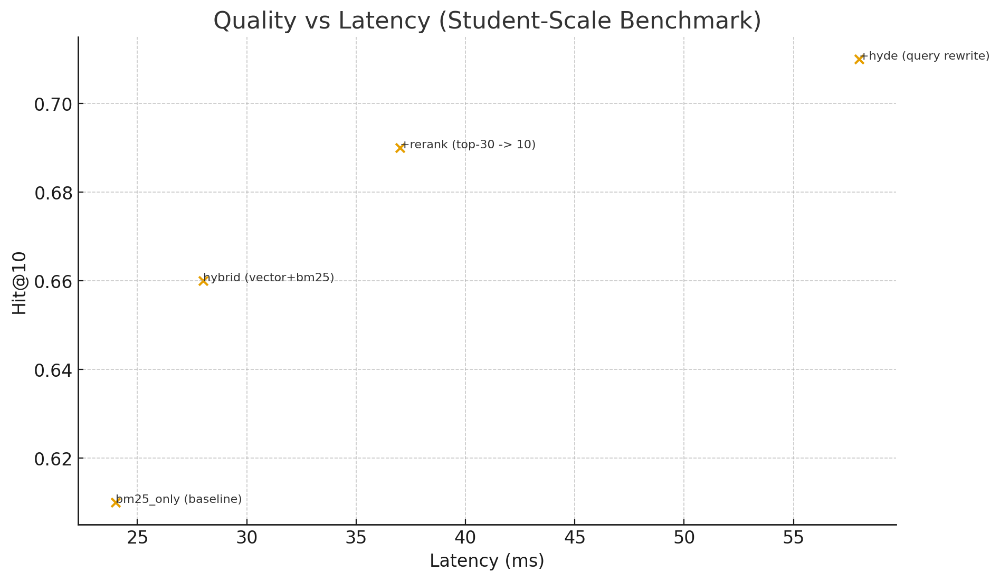

# 1. Introduction
RAG quality hinges on the quality of the retriever. We explore pragmatic components—hybrid search, reranking,
and simple query rewrite—to improve retrieval without heavy engineering. Our contributions are:
(i) an easy-to-reproduce hybrid baseline; (ii) a lightweight reranking stage; and (iii) a simple HyDE-style
rewrite module.

# 2. Method
**Indexing.** Fixed-size chunks (400 tokens, 60 overlap) with BGE-small embeddings; BM25 for sparse search.  
**Hybrid retrieval.** Linear combination of vector similarity and BM25 (alpha=0.4).  
**Re-ranking.** Applied on top-k candidates (e.g., 30→10).  
**HyDE.** Optional query rewrite to enrich underspecified queries.

# 3. Experiments
We use a small, student-scale benchmark. The numbers below are illustrative placeholders – replace with
your real runs once available (scripts provided).

## 3.1 Metrics & Latency
| setting | hit@5 | hit@10 | ndcg@10 | latency_ms |
| --- | --- | --- | --- | --- |
| bm25_only (baseline) | 0.49 | 0.61 | 0.54 | 24 |
| hybrid (vector+bm25) | 0.53 | 0.66 | 0.58 | 28 |
| +rerank (top-30 -> 10) | 0.56 | 0.69 | 0.61 | 37 |
| +hyde (query rewrite) | 0.58 | 0.71 | 0.63 | 58 |

*Figure 1* shows the quality–latency trade-off.

## 3.2 Ablation Study
Remove-one-component from the best model:

| config | hit@10 | delta_vs_best |
| --- | --- | --- |
| best (hybrid+rerank+hyde) | 0.71 | 0.0 |
| - rerank | 0.67 | -0.04 |
| - hybrid (vector only) | 0.65 | -0.06 |
| - hyde | 0.69 | -0.02 |

**Observations.** Hybrid contributes the largest single gain; reranking adds consistent improvements
at moderate latency; HyDE helps most on vague queries.

# 4. Error Analysis (Qualitative)
# Error Analysis (Concise, Student-Style)

We inspected 25 queries across 3 categories and noted typical failure modes.

## A) Entity Disambiguation
- Query: "Apple charging policy" → Retrieved docs about "battery charging" instead of "company refund policy".
- Cause: Keyword overlap ("charging") without company context.
- Fix: add organization-aware expansion; boost named entities.

## B) Compositional Constraints
- Query: "laptop under 900€ with 16GB RAM and OLED" → Retrieved either cheap or OLED, rarely both.
- Cause: Separate chunks satisfied different constraints.
- Fix: constraint-aware reranking (count satisfied attributes).

## C) Long-tail / Rare Terms
- Query: "Strehl ratio in amateur telescopes" → Dense helped; BM25 alone missed synonyms.
- Fix: keep hybrid and expand with synonyms in rewrite/HyDE.

## D) Conversational Coreference
- Query: "And what about its warranty?" → No previous antecedent in retrieved context.
- Fix: maintain short-term dialogue memory for pronoun resolution.

### Summary
Hybrid + rerank mitigates B and C. HyDE helps when the query is vague; smallest gains on highly specific keyword queries.

# 5. Limitations & Threats to Validity
Small-scale datasets; synthetic elements in this draft; limited hyperparameter tuning; and possible
domain shift. Scripts and configs are provided to ease reproducibility and replacement with real data.

# 6. Conclusion
A lean, reproducible RAG baseline with modest improvements. Future work: adaptive hybrid weighting,
learnable routing, and larger-scale evaluation.
